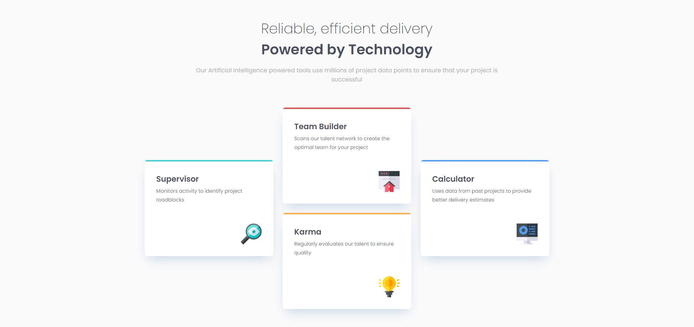
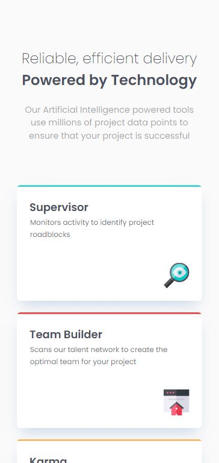

# Frontend Mentor - Four card feature section solution by Marcia Belen Alvarez

This is a solution to the [Four card feature section challenge on Frontend Mentor](https://www.frontendmentor.io/challenges/four-card-feature-section-weK1eFYK). Frontend Mentor challenges help you improve your coding skills by building realistic projects. 

## Table of contents

- [Overview](#overview)
  - [The challenge](#the-challenge)
  - [Screenshot](#screenshot)
  - [Links](#links)
- [My process](#my-process)
  - [Built with](#built-with)
  - [What I learned](#what-i-learned)
  - [Continued development](#continued-development)
- [Author](#author)

**Note: Delete this note and update the table of contents based on what sections you keep.**

## Overview

### The challenge

Users should be able to:

- View the optimal layout for the site depending on their device's screen size. It has one breakpoint using media queries, so it's tablet/mobile view and then desktop and above view. 

### Screenshot
**Desktop Screenshot**

**Mobile Screenshot**

### Links

- Solution URL: [Solution URL at Frontent Mentor](https://www.frontendmentor.io/solutions/four-card-section-responsive-using-grid-mobile-first-approach-AWmkNXayrv)
- Live Site URL: [Live Site preview](https://marciabel.github.io/four-card-feature-section-fem/)

## My process

### Built with

- Semantic HTML5 markup
- CSS3
- Flexbox
- CSS Grid
- Mobile-first workflow

### What I learned

I got some practice with CSS grid, changing the layout depending on the size of the viewport. I tried to keep the code as vanilla as possible, since I'm trying to get a good grasp of the basics before adding any frameworks or libraries to it. 

### Continued development

In my next few projects I would like to start adding some JavaScript and maybe some pre-processor for CSS, like SASS.

## Author

- Website - [Marcia Belen Alvarez](https://www.linkedin.com/in/marciabelenalvarez/)
- Frontend Mentor - [@marciabel](https://www.frontendmentor.io/profile/marciabel)
- Twitter - [@Marcia_Dev](https://twitter.com/Marcia_Dev)
